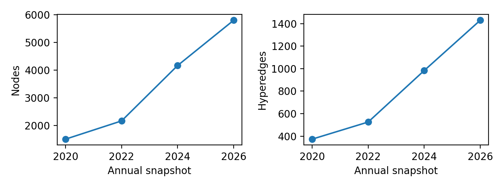
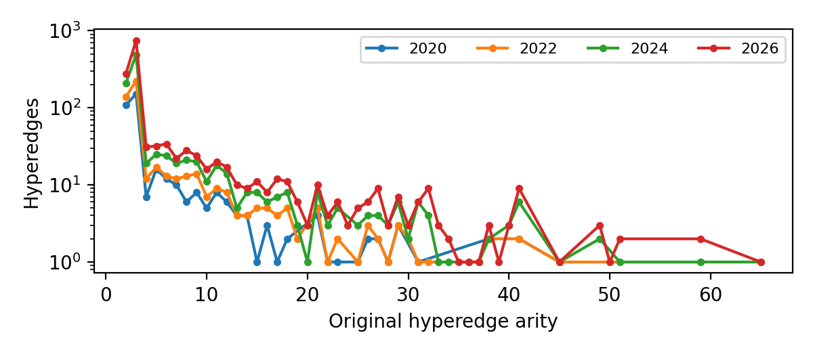
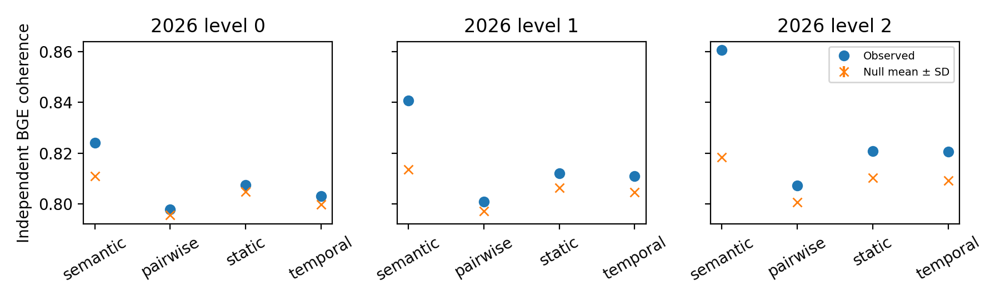
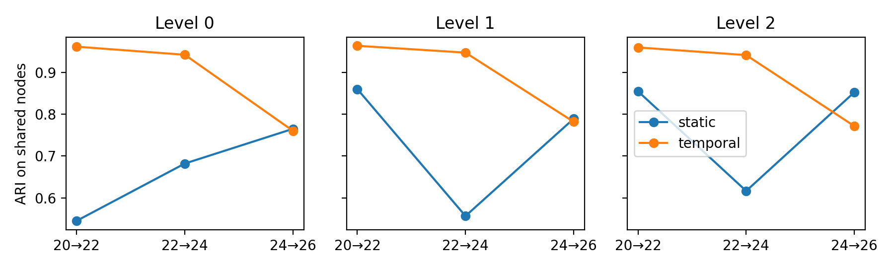
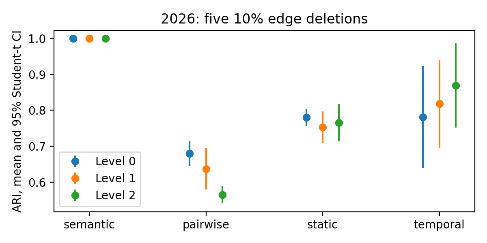
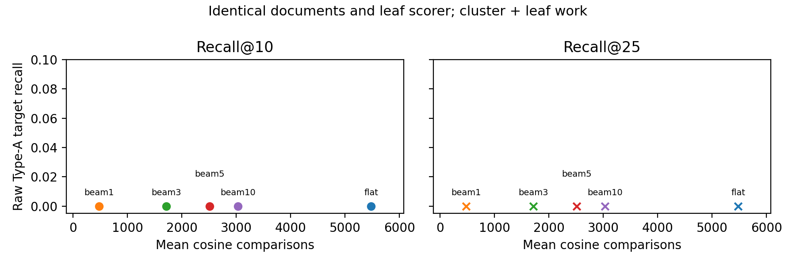

# Temporal Semantic Hypergraph Coarsening

## 1. Problem and formal statement

We construct a laminar hierarchy by greedily balancing semantic compactness against native hyperedge fragmentation, with variation-of-information regularization preserving continuity across annual snapshots. We independently evaluate coherence, stability, labels and downstream navigation. This is a small research implementation; no learned clustering, benchmark tuning or historical result reuse is involved.

For the visible hypergraph $H_t=(V_t,E_t)$, partitions $P_3\preceq P_2\preceq P_1\preceq P_0$ have singleton leaves and at most 120/40/12 clusters. These **design choices are display budgets**, not estimated natural community counts. Unit MiniLM vectors encode only `type: surface_form`. With $\mu_C=|C|^{-1}\sum_{v\in C}x_v$, $p_{e,C}=|e\cap C|/|e|$, and shared nodes $U_t$, our objective is

$$J_t(P)=\alpha\underbrace{\frac{\sum_C\sum_{v\in C}\|x_v-\mu_C\|^2}{4|V_t|}}_{S(P)}+(1-\alpha)\underbrace{\frac{1}{|E_t|}\sum_e\frac{-\sum_Cp_{e,C}\log p_{e,C}}{\log|e|}}_{F(P)}+\lambda\underbrace{\frac{VI(P|_{U_t},P_{t-1}|_{U_t})}{2\log|U_t|}}_{T(P,P_{t-1})}.$$

Set $T=0$ for fewer than two shared nodes. Fixed $\alpha=.5$ gives the normalized terms equal nominal status; $\lambda=.2$ treats history as a regularizer, with zero history weight in 2020. Normalization does not equalize their realized influence: unit-vector $S$ is at most .25. New nodes do not contribute to VI. Every stage uses the previous snapshot's partition at its own target level.

The algorithm performs **restricted-candidate greedy minimization** of this objective. Start at singletons, propose the union of semantic 10-nearest-neighbor and hyperedge co-membership pairs, and repeatedly merge the pair with minimum exact Ward/fragmentation/VI delta in a lazy heap. New neighbors are the union of merged neighbors. Continue through 120→40→12 without reclustering. If the proposal graph disconnects before the budget, join the nearest current centroids deterministically. Co-membership pairs propose merges; the native objective uses original edge endpoint distributions. No global optimum is claimed.

| Property | Status | Basis |
| --- | --- | --- |
| P1 Laminarity | Guaranteed by construction; tested | Only merges; unique parent and union-of-children invariants |
| P2 Budgets | Guaranteed by construction; tested | Each stage stops at its display budget |
| P3 Coherence | Empirical | Independent BGE evaluation against type/size-preserving nulls |
| P4 Fidelity | Structural preservation; empirical partition quality | Original edge identity, arity, multiplicity and provenance survive collapse |
| P5 Stability | Encouraged during construction; empirical degree | Shared-node VI regularization; ARI/VI measured afterward |
| P6 Faithfulness | Conservative generation; empirical proxy | Disjoint held-out evidence and NLI/lexical checks |

Brute-force semantic proposals cost $O(n^2d)$ plus sorting, and embedding cost depends on token lengths and encoder inference. For $M$ initial proposals and $Q$ subsequent pair updates, heap work is $O((M+Q)\log(M+Q))$; each delta uses $O(d)$ semantic arithmetic, shared incident-edge counts, and overlap counts with at most 120 previous clusters. Updating unions touches incident edges and neighboring candidates. Dense proposals and total updates can approach quadratic behavior; the implementation makes no scaling claim beyond this corpus. Hungarian matching costs $O(K^3)$ per level with $K\le120$.

## 2. Data, native representation and temporal identities

**Verified input audit:** 52 article nodes, 5798 nodes, 1429 hyperedges, 12 node types and 11 relation types; 18 questions rather than the README's 17. Input SHA256 hashes and schemas are saved in `outputs/audit/input_manifest.json`. Original inputs are untouched.

| Year | Nodes | Edges | Max arity | Arity >2 |
| --- | --- | --- | --- | --- |
| 2020 | 1505 | 374 | 45 | 0.7086 |
| 2022 | 2164 | 526 | 59 | 0.7338 |
| 2024 | 4164 | 983 | 65 | 0.7864 |
| 2026 | 5798 | 1429 | 65 | 0.8048 |

Visibility requires `first_seen_year(v) <= t`, `edge.year <= t`, asserting article year <= t when known, and every endpoint visible. Origin year describes an entity's origin, not corpus visibility. **Verified:** 170 edge years predate an endpoint's visibility and 134 predate the asserting article. Whole inconsistent edges are delayed, explaining why strict counts can be below the task guide's illustrative slicing. Ingestion timestamps are not publication dates. **Limitation:** the 2026 snapshot has annual temporal resolution; therefore the implementation cannot guarantee exclusion of material appearing after February 2026 within that year.

For every actual hierarchy level, collapse each original edge to `(supernode, multiplicity)` records and retain internal edges. For example, five endpoints mapping to A,A,A,B,C become `{A:3,B:1,C:1}`. All internal, partial and ≥3-supernode cases conserve original arity. Coarse endpoint identities are unavailable from that edge record alone; member lists and original input permit reconstruction. Relation, provenance, identity and endpoint multiplicities remain explicit. This preserves higher-order grouping, without asserting irreducible superiority over every pairwise statistic.

The pairwise baseline adds $1/\binom{r}{2}$ to each endpoint pair and minimizes normalized weighted cut with the same semantic term. **Verified projection loss:** 1429 original edges produce 72701 pair instances and 70022 unique pairs; 1510 pairs (2.16%) have multiple contributing edges. Aggregation conflates overlapping source edges and cannot uniquely reconstruct their identity, arity or grouping. Clique projection is the credible simpler alternative, but is not our default representation. A neural clustering model would add training assumptions and tuning without a written requirement here.

After construction, Hungarian maximum-Jaccard matching assigns persistent IDs. This is bookkeeping, not stabilization. The many-to-many overlap log records continuation, growth, merge, split, birth and death when observed; merge/split contributions require ≥2 nodes and ≥10% of the relevant shared historical membership. Events describe membership, not scientific discoveries. Cumulative visibility need not produce deaths.

The design borrows multilevel aggregation, native hyperedge grouping and evolutionary regularization ideas, rather than reproducing a published optimizer. [Schaub et al. (2023)](https://journals.aps.org/pre/abstract/10.1103/PhysRevE.107.054305) motivate distinguishing a displayed hierarchy from evidence for natural hierarchical communities. [Chen et al. (2022)](https://link.springer.com/article/10.1007/s40324-021-00282-x) survey coarsening; [Zhou et al. (NIPS 2006)](https://papers.nips.cc/paper/2006/file/dff8e9c2ac33381546d96deea9922999-Paper.pdf) motivate hyperedge grouping; [Chi et al. (2007)](https://www.microsoft.com/en-us/research/wp-content/uploads/2017/01/evospe.pdf) motivate a current/history tradeoff. Our entropy objective and level-specific VI differ from their spectral formulations. Full citations and borrowing boundaries are in `references.md`.

## 3. Evaluation validity

MiniLM constructs the hierarchy; BGE-small independently evaluates coherence and encodes retrieval documents. Exact model revisions, seeds and all scientific choices are in `configs/default.yaml`. Ground truth is loaded for scoring only after documents and predictions have been saved and hashed. The construction modules cannot read benchmark files; target annotations are evaluation-only. A separate schema audit may count benchmark records, but passes no benchmark content to construction.

Coherence is mean member cosine to each independent evaluation centroid, reported macro and size-weighted at every level and snapshot, including singletons. Each of 100 null partitions preserves every cluster's exact size and type counts by shuffling labels within node types (seed42). We export absolute/standardized effects, null SD/mean intervals and empirical upper-tail p-values $(1+\#\{null\ge observed\})/101$. These are conditional null tests, not evidence of performance across new corpora; multiple tests are descriptive and uncorrected.

At 2026, each method is rebuilt after deleting 10% of edges with five fixed seeds (11,23,37,53,71). Previous 2024 hierarchies remain fixed: this measures sensitivity to current evidence, not propagated historical damage. ARI means, SDs and Student-t 95% intervals quantify deletion-seed variation. Semantic-only ignores both edges and edge proposals; ARI=1 denotes edge blindness, not superior structural robustness. Real temporal ARI, VI and lineage retention use shared nodes for all three adjacent transitions. Three transitions give limited statistical power; their descriptive average is not nine independent replications.

L0/L1 labels use generation-only TF-IDF 1–3-grams, generation-centroid representatives and a conservative gloss template. Authors are excluded from phrase candidates. Hash/type-stratified splitting approximates 70/30; singleton type groups go to generation. Exact inputs are retained. Held-out member evidence is capped at 1,800 characters, with premise-only NLI token truncation recorded. The overclaim proxy is one minus the held-out entailment fraction; small unevaluable clusters are null. No NLI output enters construction or retrieval. Domain mismatch, omitted evidence and easy-to-entail vague glosses limit this proxy. There was no human scientific audit. Unversioned surface forms and pretrained model knowledge prevent perfect historical information isolation despite strict graph-evidence cutoffs.

Retrieval encodes each nonauthor leaf as its type/name plus at most 12 deduplicated direct content-hyperedge neighbors. No recursive traversal, alias expansion, diffusion or reranking is used. `authored_by` and broad `cites` are excluded from scientific context. Flat scores all candidate documents; hierarchy scores descendant-document centroids through P0→P1→P2 and then the surviving leaves using exactly the same cosine. Global beams 1/3/5/10 are fixed, with 3 primary. Work counts every cluster/leaf comparison; it is not a measured latency speedup. First-target work means the first EXACT/ALIAS leaf encountered in deterministic scoring order, not first final-rank answer or a composite stopping guarantee.

The supplied target list is heterogeneous. **Verified support audit:** 63 target occurrences / 50 unique labels; basic normalized exact matching finds 47 anywhere and 28 as method nodes, leaving 16 without literal identity. Refined status counts (typographic hyphens normalized) are {'EXACT': 48, 'PARTIAL': 11, 'ALIAS': 1, 'ABSENT': 2, 'COMPOSITE': 1}. Full normalized identity accepts any graph type; safe aliases require explicit evidence. Composite labels receive component-bundle evaluation, not fabricated graph nodes. Partial evidence never earns complete-target recovery; those targets remain in the conditional denominator. Raw recall keeps all 63 supplied occurrences. Non-gold returns are unjudged. Source overlap is reported separately from strict claim-node recovery. **Claim alignment:** 1/224 accepted overall, including 1/36 Type-B claims. Semantic candidates are suggestions; only defensible accepted alignments are scored, with the remainder `NOT_EVALUABLE_ALIGNMENT`. A paper hit cannot establish its scientific claim.

## 4. Results

All numbers below are regenerated by this standalone implementation. The four variants are semantic-only, semantic+pairwise, static native and temporal native. Execution and reproduction records are in `outputs/audit/`; presentation-only amendments are separately recorded.

| Variant | Coh L0 | Coh L1 | Coh L2 | Temporal ARI | Perturb L0 | Perturb L1 | Perturb L2 |
| --- | --- | --- | --- | --- | --- | --- | --- |
| semantic | 0.8240 | 0.8407 | 0.8608 | 0.4667 | 1.000 ± 0.000 | 1.000 ± 0.000 | 1.000 ± 0.000 |
| pairwise | 0.7978 | 0.8008 | 0.8073 | 0.6897 | 0.679 ± 0.028 | 0.637 ± 0.047 | 0.565 ± 0.020 |
| static | 0.8075 | 0.8120 | 0.8208 | 0.7247 | 0.780 ± 0.019 | 0.753 ± 0.036 | 0.765 ± 0.042 |
| temporal | 0.8029 | 0.8108 | 0.8205 | 0.8924 | 0.781 ± 0.115 | 0.818 ± 0.099 | 0.869 ± 0.094 |

Coherence is 2026 size-weighted BGE; temporal ARI averages three transitions and three levels descriptively; perturbation columns give five-seed mean ± SD. Temporal absolute gains over its size/type-preserving null are 0.0033/0.0062/0.0113 (L0/L1/L2), with empirical p=0.0099, the 1/101 resolution floor. These are small cosine differences; large standardized effects reflect the tiny conditional-null SD, not large population effects. Full macro values, all snapshots and intervals remain in `outputs/metrics.json` and tables.

Temporal perturbation 95% intervals are L0 [0.639, 0.923]; L1 [0.695, 0.940]; L2 [0.751, 0.986]. They overlap static intervals substantially. Five seeds and greater temporal variability do not establish superior perturbation robustness.

**Computed tradeoff:** temporal versus static native changes descriptive mean cross-snapshot ARI from 0.7247 to 0.8924, and mean 2026 coherence across levels from 0.8134 to 0.8114. This supports a continuity benefit on this corpus. Perturbation and label quality remain separate criteria; the result does not establish universal superiority or justify downstream tuning.

| Variant | Level | Labels | Evaluable | Unavailable | Overclaim | Entail | Neutral | Contradict | Truncated |
| --- | --- | --- | --- | --- | --- | --- | --- | --- | --- |
| semantic | 0 | 48 | 44 | 4 | 0.3864 | 27 | 12 | 5 | 27 |
| semantic | 1 | 160 | 152 | 8 | 0.3224 | 103 | 29 | 20 | 42 |
| pairwise | 0 | 48 | 37 | 11 | 0.4054 | 22 | 10 | 5 | 6 |
| pairwise | 1 | 160 | 46 | 114 | 0.4565 | 25 | 11 | 10 | 6 |
| static | 0 | 48 | 44 | 4 | 0.1364 | 38 | 5 | 1 | 14 |
| static | 1 | 160 | 124 | 36 | 0.3710 | 78 | 29 | 17 | 13 |
| temporal | 0 | 48 | 44 | 4 | 0.3182 | 30 | 11 | 3 | 16 |
| temporal | 1 | 160 | 130 | 30 | 0.3077 | 90 | 26 | 14 | 15 |

Labels are pooled across four snapshots. Temporal has a worse L0 overclaim proxy than static, but a better L1 proxy; pairwise leaves most L1 labels unevaluable. This is a mixed label-quality result. The proxy is not a human scientific error rate: generation-only names and sorted-ID truncation can omit evidence, and domain mismatch affects classification. All probabilities and truncation flags remain available.

| System | K | Recovered | Raw N | Supported N | Raw recall | Conditional recall | Mean comparisons | First-hit median | No first hit |
| --- | --- | --- | --- | --- | --- | --- | --- | --- | --- |
| flat | 10 | 0 | 63 | 61 | 0.0000 | 0.0000 | 5480.0000 | 85.0000 | 2 |
| beam1 | 10 | 0 | 63 | 61 | 0.0000 | 0.0000 | 476.9444 | 110.0000 | 12 |
| beam3 | 10 | 0 | 63 | 61 | 0.0000 | 0.0000 | 1711.7222 | 136.0000 | 7 |
| beam5 | 10 | 0 | 63 | 61 | 0.0000 | 0.0000 | 2508.2222 | 142.0000 | 3 |
| beam10 | 10 | 0 | 63 | 61 | 0.0000 | 0.0000 | 3030.9444 | 171.0000 | 2 |
| flat | 25 | 0 | 63 | 61 | 0.0000 | 0.0000 | 5480.0000 | 85.0000 | 2 |
| beam1 | 25 | 0 | 63 | 61 | 0.0000 | 0.0000 | 476.9444 | 110.0000 | 12 |
| beam3 | 25 | 0 | 63 | 61 | 0.0000 | 0.0000 | 1711.7222 | 136.0000 | 7 |
| beam5 | 25 | 0 | 63 | 61 | 0.0000 | 0.0000 | 2508.2222 | 142.0000 | 3 |
| beam10 | 25 | 0 | 63 | 61 | 0.0000 | 0.0000 | 3030.9444 | 171.0000 | 2 |

**Observed navigation result:** primary beam3 recovers 0/63 at ten using 1711.7 mean comparisons; flat recovers 0/63 using 5480.0. No scorer or beam was changed. Evaluation-only positive controls recover all 49 actual EXACT/ALIAS instances when their mapped node is placed first; synthetic tests separately verify context-only mentions do not count as identities. Actual flat ranks start at 31 (Q12 MatterSim); Q3 DeepH-E3 is 57. These checks support a ranking failure under this recovery rule, rather than an evaluator that always returns zero. Controls and traces are in `notes/retrieval_positive_control.json` and `notes/output_inspection.md`.

Type-B strict recovery is unevaluable for 35/36 claims. The single aligned claim is recovered in 0/10 system/cutoff evaluations. The broader signal is coarse source overlap: at ten, flat/beam3 macro source recovery is 0.750/0.750; this is not claim correctness. The Q18.C16 mapping was annotated post-hoc after inspecting frozen results, so it is not independent validation. Full per-question scores, composite coverage and source recovery are exported. Direct identities and composite document bundles are distinct recovery units. First-hit medians exclude misses and depend on ID scan order; total comparisons versus recall is the efficiency comparison. A restricted candidate pool can promote an item by removing competitors.

| Parameter | Value | ARI vs primary L0 | L1 | L2 |
| --- | --- | --- | --- | --- |
| alpha | 0.2500 | 0.6983 | 0.8144 | 0.8213 |
| alpha | 0.5000 | 1.0000 | 1.0000 | 1.0000 |
| alpha | 0.7500 | 0.6165 | 0.6928 | 0.6986 |
| lambda | 0 | 0.3761 | 0.4931 | 0.6475 |
| lambda | 0.1000 | 0.7598 | 0.8378 | 0.8494 |
| lambda | 0.2000 | 1.0000 | 1.0000 | 1.0000 |
| lambda | 0.4000 | 0.7493 | 0.7725 | 0.7750 |
| knn_k | 5 | 0.9341 | 0.9905 | 0.9975 |
| knn_k | 10 | 1.0000 | 1.0000 | 1.0000 |
| knn_k | 20 | 0.9501 | 0.9974 | 0.9988 |

Sensitivity varies one parameter at a time at 2026 with fixed primary 2024 history. Alpha/lambda materially alter memberships, while k=5/20 remain close to k=10. These are dependence diagnostics, not downstream selection. The temporal method is a defensible continuity-oriented default, with small coherence gains over null, mixed label quality and no demonstrated retrieval benefit; native representational fidelity does not establish performance superiority.

## 5. Limitations and four more weeks

The optimization is greedy and proposal-dependent; the corpus is small and dates are annual. Labels may be generic and the NLI proxy is imperfect. Claim alignment accepts exact text/source matches or explicitly inspected evaluation-only annotations; other valid claims may remain unevaluable. One assistant-reviewed Q18.C16 alignment links long-range transferability to clai_00167 and the same source article. This is no substitute for independent expert review. Partial/composite annotations also require review. The benchmark has been repeatedly examined and supplies incomplete target lists; this is development evaluation, with no held-out external question set. No production scalability or causal scientific validity is claimed.

Actual inspection found large dominant clusters (primary final L0/L1/L2 maxima: 3765/3043/2615 nodes), generic phrases and occasional author-like cited-work representatives. Fixed budgets do not imply balanced or useful communities. Top retrieval documents can discuss gold methods while direct gold nodes rank below 25; an evidence hit is not automatically a target-identity hit. See `notes/output_inspection.md` for traces. The reported temporal average also hides a qualification: temporal ARI is below static at 3/3 levels in the last transition, while normalized VI and lineage retention favor temporal at 3/3 levels. Thus the last-transition conclusion depends on the stability metric. These limitations are retained rather than repaired by outcome-based tuning.

With four more weeks, prioritize blinded expert label/target audits and claim alignment, precise publication-date versioning, genuinely held-out downstream questions, then scalable candidate generation if profiling justifies it. A stronger objective would follow diagnosed failures rather than benchmark-driven tuning. Reproduction instructions, dependency pins and tests are in `README.md`; `AI_USAGE.md` records the master prompt, Codex implementation and Ultralight reviews. `outputs/audit/gate_K.json` documents fresh-output execution and scientific equality checks; `presentation_amendment.json` records subsequent report/figure changes without metric changes.

## Figures

