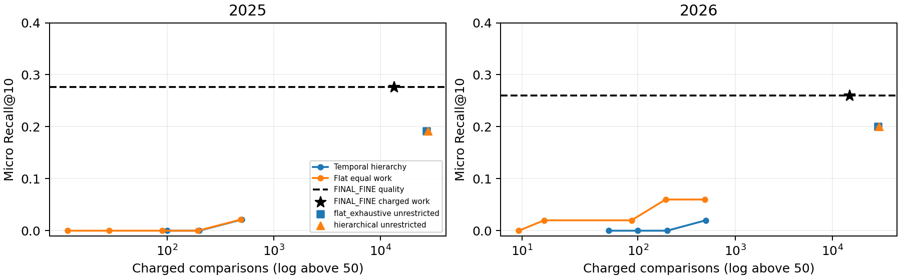

# Temporal native-hypergraph abstraction: final assessment

## Problem and formal statement (T1, T2; Deliverable 0)

The supplied TKH contains **5,798 nodes, 1,429 native hyperedges, 12 node types and 11 relation types**; 80.48% of edges have arity greater than two. Consistently visible snapshots contain 1,505/374 nodes/edges (2020), 2,164/526 (2022), 4,164/983 (2024) and 5,798/1,429 (2026). `artifacts/full/descriptive.json` gives distributions and growth. Data-quality checks find 170 edges preceding a member's visibility, 134 preceding the asserting article, and three origin-year/first-seen inconsistencies; counts overlap. Visibility requires first-seen nodes and an edge whose date, asserting paper and all members are available. This is retrospective publication visibility, not ingestion history.

For H_t=(V_t,E_t), seek exclusive covering partitions P_0,…,P_3 with hard budgets **12 / 40 / 120 / singleton leaves**, and each child contained in exactly one parent. Greedy restricted-candidate merges minimize increments of

**J(P_t)=0.30 J_hyper + 0.20 J_spec + 0.35 J_sem + 0.15 J_temp.**

J_hyper is native edge-weighted fragmentation: (1−Σ_C(m_eC/n_e)²)/(1−1/n_e), averaged over original edge weights. J_spec is normalized within-cluster dispersion in global native-hypergraph spectral coordinates; J_sem is the analogous MiniLM semantic dispersion. J_temp is predecessor-partition VI on common base nodes divided by log(common-node count), zero with at most one common node. Active weights are renormalized when a term is disabled, including time at the first snapshot. Semantics and structure explicitly share the objective; neither acts as a post-hoc veto. No global optimum is claimed.

**P1 laminarity and P2 budgets are guaranteed by construction; P4 fidelity is procedurally guaranteed by native collapse. P3 coherence, P5 stability and P6 label faithfulness are empirical.** Display budgets do not prove natural communities. Sparse incidence products cost O(I+n) for I incidences; storage is O(I+n) plus embeddings. Neighbor proposals can cost O(n²(d+q)); restricted greedy merges can approach quadratic work. Matching coarse identities costs O(N³). No large-corpus scaling guarantee is established.

## Related work

[Zhou, Huang & Schölkopf (2006)](https://proceedings.neurips.cc/paper_files/paper/2006/hash/dff8e9c2ac33381546d96deea9922999-Abstract.html) supplies normalized native incidence geometry; this method adds fragmentation, semantics and temporal VI. [Chen, Saad & Zhang (2022)](https://doi.org/10.1007/s40324-021-00282-x) motivates recursive coarsening; here each next level consumes the actual collapsed hypergraph, without an approximation-error guarantee. [Schaub, Li & Peel (2023)](https://doi.org/10.1103/PhysRevE.107.054305) distinguishes producing a hierarchy from demonstrating meaningful hierarchy; our null and downstream tests address that distinction. [Chi et al. (2007)](https://www.microsoft.com/en-us/research/wp-content/uploads/2017/01/evospe.pdf) motivates the current-fit/temporal-smoothness tradeoff; our VI regularizer differs from their evolutionary spectral objective. Existing source verification and fuller synthesis are in `report/literature_notes.md`.

## Method: temporal coupling, collapse and labels (T3–T5)

Construction-time **VI regularization** supplies stability. Post-construction **Hungarian overlap matching** tracks persistent identities; matching itself does not regularize construction. Birth, growth, continuation, merge, split and death are exported with source/target snapshots, IDs and overlap statistics in `artifacts/evaluation/final/temporal_events.json`. On common nodes in 2024→2026, temporal L0 ARI is .636 versus static .351, at a small coherence change from .777 to .775.

Collapse handles all three cases. For **m=n**, retain the fully internal edge as provenance/evidence and remove it from inter-supernode spectral incidence. For **1<m<n**, merge repeated endpoints and retain multiplicity m_eC: {a,b,c,d}→{S1:3,S2:1}. If endpoints occupy **three or more supernodes**, retain one coarse hyperedge over every distinct supernode with multiplicities. Original members, relation identity and provenance remain traceable; fine endpoint distinctions disappear from working coarse geometry. Implemented collapse is the next level's structural input. Binary spectral incidence omits multiplicity, while the fragmentation term uses it.

The rejected pairwise alternative expands 1,429 native edges into **72,701 pair instances / 70,022 unique pairs (50.88×)**. Different higher-order configurations can induce identical weighted adjacency. Native edge identity is therefore retained for TKH fidelity, not a claim that every objective term is irreducibly higher-order or wins every metric; pairwise perturbation ARI is higher.

Labels are extractive noun/keyphrases plus a short non-comparative one-sentence gloss. At L0/L1 the repaired labeler sees only `cutoff`, `generation_members`, `generation_type_counts`, and `generation_only_relation_counts`; generation relations are fully contained in the generation split. Snapshot-valid generation/evaluation members are separated where feasible. The final exports overlay these frozen labels without changing hierarchy membership. No post-cutoff member/evidence enters the packets, but unversioned text and retrospective model pretraining limit stronger temporal claims.

## Evaluation validity (T6)

**MiniLM drives clustering; BGE independently evaluates coherence**, excluding singletons. Fifty exact-size random-label permutations and a within-type null accompany observed scores. Temporal L0 has observed .7748 versus size-null .7602 (difference .0146, permutation p=.0196); the type-stratified difference is .0054. These are small effects and uncorrected descriptive p-values across several levels/variants.

Perturbation removes round(10% of hyperedges), then rebuilds with five fixed seeds **11,23,37,53,71** and fixed predecessor. Temporal L0 ARI is .550, approximate Student-t 95% CI **[.497,.603]**; normalized VI is .158 [.133,.182]. These are perturbation intervals, separate from exhaustive real cross-snapshot ARI. Native construction, nulls, perturbation, labeling and all historical metrics were preserved, not retuned.

Held-out gloss proxies over four snapshots give L0 entailment/neutral/contradiction **.458/.479/.062**, non-entailment **.542**; L1 **.521/.354/.125**, non-entailment **.479** (48 evaluable samples each). NLI is not ground truth, neutral is not demonstrated falsehood, and non-entailment is only an overclaim proxy. Shorter/weaker glosses can improve this proxy. Blind expert adjudication remains absent: **P6 is only partially validated**.

### Fixed fine reference and hierarchy experiment

**FINAL_FINE** is the historical `without_qualifiers` configuration: generic CR1-derived decomposition with the already implemented generic grammar/attribution fixes → frozen H2 top100 → query-independent wider evidence pools → component-only BGE cosine, attribution weights and top-three evidence/max support → unchanged CR1 core-gated geometric aggregation → top10. Qualifiers remain diagnostics; there is **no qualifier score, NLI, fusion, new alias or primary K200**. Both cutoffs reproduced exact archived candidate scores/ranks before hierarchy traversal; full rankings and hash regressions are archived.

| Cutoff | Top10 / canonical | Macro R10 | Unique R10 | Raw /63 | MRR | R-Prec / R@R | Median / mean gold rank |
| --- | --- | --- | --- | --- | --- | --- | --- |
| 2025 | 13/47 | 0.4455 | 0.3529 | 13/63 | 0.5273 | 0.3344 / 0.3344 | 28.0 / 88.09 |
| 2026 | 13/50 | 0.4401 | 0.3243 | 13/63 | 0.5216 | 0.3290 / 0.3290 | 26.0 / 83.18 |

All 14 Type A questions remain; Q5/Q11 have no canonical units and null recall. Macro metrics average 12 evaluable questions; micro denominators are 47/50, raw denominator 63. Unique recall retains the union-of-target-names definition. Four Type B questions and all historical outputs remain archived; the new entity experiment is Type A only. FINAL_FINE was selected on this reused benchmark, so these are development diagnostics, not held-out generalization.

The frozen temporal hierarchy starts at all eligible L0 roots, scores **.5 centroid cosine + .5 mean(best two of four farthest-point prototype cosines)**, and expands deterministically best-first through L1/L2 to atomic leaves. One reached member activates its existing exact-name entity group once; full group evidence is then accessible, explicitly extending access beyond that one atomic occurrence. Only reached groups receive fine scores. Main hierarchy/flat exhaustive search all fixed H2-eligible groups, while FINAL_FINE uses its H2 prefix; the H2-intersection ceiling checks approximation separately from changed candidate discovery. No expected names or claims guide search.

Predeclared total-work budgets are **25,50,100,200,500**, plus unrestricted traversal. Budgets below the full root-layer cost are `INSUFFICIENT_ROOT_BUDGET`, not evidence of hierarchy failure. Work charges every centroid/prototype/leaf and component–evidence comparison, including logically reused comparisons; aggregation counts are separate. Offline embeddings, hierarchy/pools, model loading, query encoding, graph enumeration and export diagnostics are excluded. FINAL_FINE additionally charges archived H2 vector work; its sparse incidence visits remain separate. Cross-system caches affect execution time, not standalone charges. Thus counts are a declared work proxy, never a production latency speedup.

Flat equal-work uses the same budget and scorer over a fixed seed-42 random group prefix; a candidate is included only if its complete cost fits. It stops at the first unaffordable group; hierarchy continues through its frontier and can score later affordable groups. This policy asymmetry is fixed and disclosed, not adjusted after outcomes. Flat exhaustive scores every eligible group with the identical final scorer. Both are grouped entity baselines; the historical all-node surface-only baseline remains supplemental.

## Results

| Variant | BGE / null | Perturbation ARI [95% CI] | Temporal ARI | L0 non-entailment proxy | Final hierarchy R@10 (500) | Comparisons |
| --- | --- | --- | --- | --- | --- | --- |
| semantic | 0.783 / 0.760 | 1.000 [1.000, 1.000] | 0.397 | 0.479 | 0.021 | 500.0 |
| structural | 0.763 / 0.760 | 0.512 [0.392, 0.633] | 0.703 | 0.667 | 0.021 | 500.0 |
| static | 0.777 / 0.760 | 0.464 [0.439, 0.490] | 0.351 | 0.667 | 0.000 | 499.9 |
| temporal | 0.775 / 0.760 | 0.550 [0.497, 0.603] | 0.636 | 0.542 | 0.021 | 500.0 |
| pairwise | 0.776 / 0.760 | 0.644 [0.589, 0.700] | 0.696 | 0.729 | 0.000 | 500.0 |

Intrinsic columns use 2026 L0 and temporal ARI uses 2024→2026; label proxies aggregate four snapshots. Retrieval columns are the **new 2025 final experiment at budget500**, not obsolete leaf-ranking results. Semantic-only has highest coherence and ignores edges (ARI=1 under edge removal is therefore expected); structural has strong temporal continuity but weaker semantics; static has good semantics but weaker continuity; temporal pays a small coherence cost for persistence; pairwise is perturbation-stable but discards native relation identity. Ship temporal for the required combination, not as a scalar winner.

Conservative 2025 extrinsic results (all costs mean per 14 questions):

| System / budget | R@10 | Unique R@10 | MRR* | Retained fine hits | Fine scores | Comparisons | Expansions | Candidate source hit | Strict claim recall |
| --- | --- | --- | --- | --- | --- | --- | --- | --- | --- |
| FINAL_FINE all | 13/47 (0.277) | 0.353 | 0.527 | 13/13 | 100.0 | 13359.5 | 0.0 | 0.131 | N/A |
| flat_exhaustive all | 9/47 (0.191) | 0.265 | 0.515 | 9/13 | 2564.0 | 26791.1 | 0.0 | 0.110 | N/A |
| flat_equal_work 500 | 1/47 (0.021) | 0.029 | 0.083 | 1/13 | 61.8 | 488.9 | 0.0 | 0.010 | N/A |
| hierarchical/temporal 500 | 1/47 (0.021) | 0.029 | 0.042 | 0/13 | 41.9 | 500.0 | 27.6 | 0.010 | N/A |
| hierarchical/temporal all | 9/47 (0.191) | 0.265 | 0.515 | 9/13 | 2564.0 | 27797.1 | 154.0 | 0.110 | N/A |
| hierarchical_h2_intersection/temporal all | 13/47 (0.277) | 0.353 | 0.526 | 13/13 | 100.0 | 7631.5 | 154.0 | 0.131 | N/A |

*MRR uses each system's complete available ranking: FINAL_FINE retains its historical H2 tail, while budgeted searches rank only scored groups. MRR and uncapped gold-rank statistics therefore have different candidate coverage; compare top-ten recovery and fine-hit retention for the primary approximation question. H2-intersection comparison cells report traversal work only; the prerequisite H2 retrieval is charged separately in the detailed cost table.

At budget500, hierarchy retains **0/13** fine hits, with **1 hierarchy-only recoveries**; the latter are distinct from retention. It scores 41.9 rather than100 fine candidates (58.1% fewer), and charges 500.0 rather than 13359.5 comparisons (96.3% fewer). Equal-work flat recovers 1/47. Counts exclude H2 incidence work and other operations above; lower work alone is not success.

Unrestricted hierarchy exactly matches exhaustive flat rankings, recovering 9/47 and 10/50 and retaining 9/13 fine hits at both cutoffs, with additional traversal cost. Expanding the candidate universe changes competition even with the same fine scorer. Unrestricted H2 intersection recovers the reference 13/47 and 13/50, but already requires H2 membership: including H2 vector work costs 16929.5 and 18990.6 comparisons, plus H2 incidence visits. It is an approximation control, not an independent cheap discovery mechanism.

Retain temporal hybrid as the scientific browsing hierarchy, with faithfulness still only partially validated. The current search policy is not justified as a retrieval accelerator: reduced work comes with loss of all FINAL_FINE top-ten hits at budget500 in both cutoffs.

Supporting claims have three separate layers: entity recovery; selected evidence/provenance; and strict alignment where evaluable. Every top-ten entity exports selected node IDs/text, attribution, article IDs, graph paths, component cosine and question similarity. Expected claims enter evaluation only. Archived strict alignment resolves **0/188 required Type A claims and 0/36 Type B claims**; all required-claim recalls remain **null / NOT_EVALUABLE_ALIGNMENT**. Two supplemental Type A evidence excerpts previously aligned; they are not substitutes for required claims. Candidate source hit measures the fraction of source-mappable expected claim items with source overlap in evidence of the matching returned entity, then averages over 12 source-evaluable questions. It is claim-item-weighted within each question, not entity recall or entailment. The weaker any-entity source hit is separately exported. All per-question counts, unmapped sources and evidence traces are retained; `final/claim_evaluability.json` includes all 18 questions at both cutoffs.

Annual-2026 sensitivity, which can include papers after February, retains FINAL_FINE's 13/50. Hierarchy500 recovers 1/50, retains 0/13 and scores 33.9 fine groups for 500 comparisons, versus FINAL_FINE's 100 groups and 14,978.6 comparisons. Equal-work flat recovers 3/50 and retains 1/13. Full 2026 tables, zero-candidate question counts and every budget are in `artifacts/evaluation/final/integration_details.md`. CR2/CR4 remain negative local-NLI ablations; CR7 preserves some H2 hits but has lower top10 recovery than standalone conditioned scoring. They are archived and never invoked by FINAL_FINE.

## Verified versus assumed, limitations and four more weeks (T7)

**Verified:** snapshot/arity counts; budget, exclusivity and laminarity checks; native collapse use and event exports; executed coherence/null/ARI values; final scores/ranks/cost traces; **245 passing tests**; **655 frozen files** preserved (additive CLI dispatch excluded). Verification concerns implementation and measured proxies, not scientific truth.

**Assumed or proxy:** publication-date semantics; unversioned text's historical validity; MiniLM/BGE scientific meaning; NLI gloss support; lexical entity identity; reasonable fixed weights; incomplete benchmark labels. Source overlap is not claim entailment. Evidence access can improve rank while comparative baselines, numerical extrapolation or wrong entity types remain unsupported. FINAL_FINE still misses most canonical targets. P6 and supporting-claim validity are incomplete, and no expert or unseen-query validation is claimed.

With four more weeks: obtain versioned source text, independently adjudicate labels and claims, improve claim alignment, reserve an independent query set, and study split-aware refinement and larger-corpus scaling. No further reranker, threshold sweep or hierarchy redesign is part of this final pass.

### Final decision checklist

**T1:** heterogeneous, genuinely higher-arity growing TKH; counts and date anomalies above. **T2:** explicit weighted native/spectral/semantic/VI objective, fixed budgets, greedy local optimization; P1/P2/P4 guaranteed procedurally, P3/P5/P6 empirical. **T3:** VI enforces smoothness, overlap matching tracks identities/events; .636 versus .351 temporal ARI with small coherence cost. **T4:** internal evidence retained, partial endpoints keep multiplicities, ≥3 regions keep one hyperedge; coarse geometry loses endpoint detail. **T5:** snapshot-valid split packets generate extractive labels/glosses; held-out non-entailment .542/.479, expert faithfulness unsupported. **T6:** independent BGE/nulls, five edge-removal seeds/CIs and separate temporal ARI; FINAL_FINE13/47 and13/50; hierarchy retention/work above; source recovery measurable, strict required-claim recall unevaluable. **T7:** verified facts and proxy assumptions separated; concrete four-week study above. Per-item PASS/PARTIAL/NOT_EVALUABLE and all deliverables are in `artifacts/evaluation/final_requirement_audit.json`.
